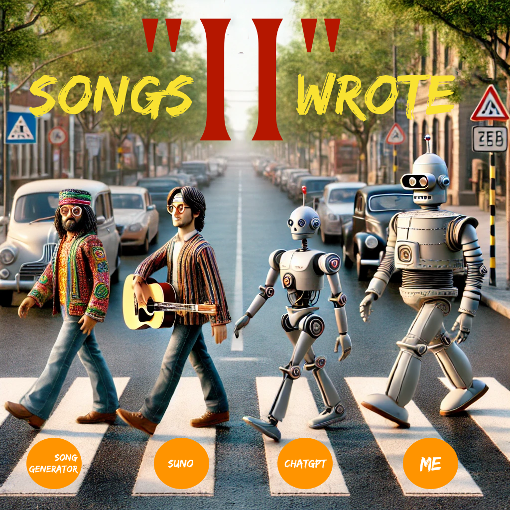
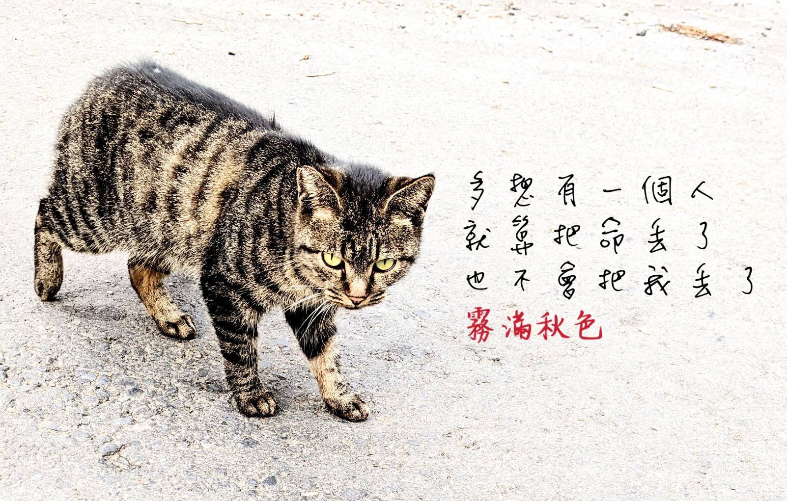

[Album Booklet in PDF Format](songs_ii_wrote.pdf)
# Songs "II" Wrote
1.	Now Teach, For You and the Young: Reflects my teaching experience in the mountains and relates to a UK journalist’s non-profit project encouraging older adults to return to schools as teachers.
2.	Before the Words Fade: Explores the thoughts of a girl who wants to be with a man she likes, without leaving regrets, yet she is too shy to express her feelings.
3.	Cheap Love You Can’t Afford: The perspective of an abandoned cat wandering in the wild, longing for someone who would rather abandon their life than abandon it.
4.	We Are The Worlds: Contrasts the excitement for Taylor Swift’s expensive global tour with the harsh reality of war tearing apart lives on the other side of the world.
5.	Petals Fall: A young teacher finds joy in teaching in the mountains, but his girlfriend gradually drifts away from him.
6.	Eye Drops, Words Unsaid: A grieving mother, haunted by the words she never got to say to her deceased child, finds a magic eye drop that brings her child back to her through a tearful reunion across time.
7.	The Story Minds Are Made Of: Chronicles the key moments in AI development from the 1960s to the present.
8.	Final Game: Describes the three stages of life after age fifty, embracing life with courage and seizing the last opportunities before the inevitable end.
9.	Do Right To Earn Miss Right: Explains the concepts of Alpha and Beta, and how sometimes failing to find love is a result of a misguided mindset.
10.	Pacific Coins: A boy once tossed a coin into the Pacific, vowing to reach the other side. Years later, he fulfills his dream, and his family’s new journey begins on the far shore.

# The Story Behind This Album
After releasing my first album, "Songs 'I' Wrote," I realized there were still many untold stories. This made me wonder how long it would take to create "Songs 'II' Wrote." Now, much sooner than expected, it's here.

The first song, "Now Teach, For You and Young," reflects my experience teaching in a mountain school as part of a non-profit project. This initiative aligns with the vision of a UK journalist who advocates for older individuals to return to teaching. She left her job at the *Financial Times* to start this movement, which you can learn more about on [their website](https://nowteach.org.uk/).

"Before the Words Fade" was inspired by a photo I took in the mountains, showing a couple on a simple motorcycle. I added the caption, "Let’s get going quickly; don’t wait until one day when we’re at each other’s funerals saying, 'We should have gone back then.'" The song tells the story of a girl who hesitates to express her love, fearing it might be too late.


"Cheap Love That You Can't Afford" emerged from a moment when I encountered a stray cat during a mountain walk. The cat’s gaze was filled with longing, as if hoping I’d be the one to cherish it, unlike its previous owner. The photo inspired the line, "How I wish to meet someone who would rather lose their life than abandon me."



"We Are The Worlds" plays off the famous song "We Are the World," but with an added ‘s.’ The song contrasts the excitement of fans attending a Taylor Swift concert with the suffering of people on the other side of the world, torn apart by war. It’s not a critique but a reflection on the stark contrasts in our shared world.

"Petals Fall" draws from my time teaching in the mountains. The serene landscape and the words, "I think of you not because I am lonely; I am lonely when I think of you," gave rise to this song. It tells the story of a young teacher who loves his job but fears losing his girlfriend as their paths diverge.

"Eye Drops, Words Unsaid" is based on a short story I wrote years ago. It follows a mother who loses her beloved child and later, through a magical encounter at an optician’s shop, sees her child again. This brief reunion allows her to say the words she never could before.


"The Story Minds Are Made" is a reflection on the history of AI development from the 1960s to the present, drawing inspiration from the book *Genius Makers* by a journalist who conducted extensive interviews with key figures in AI.

"Final Game" contemplates life after 50, divided into three stages. The first stage, from 50 to 65, is the time to achieve your remaining goals. The second stage is about accepting the limitations of aging, and the third is about making peace with the end of life.

"Do Right To Earn Miss Right" is influenced by the book *The Rational Male*. While I don’t endorse using its tips to be a player, the book offers valuable insights into why our cultural teachings can lead to missteps in love.

"Pacific Coins" is my personal story. Inspired by a Hong Kong movie where the protagonist throws a coin into the sea, promising to cross it one day, I did the same as a young boy in Taiwan. Years later, I fulfilled that dream, standing on the coast of San Francisco, reflecting on the journey my family and I have made across the Pacific.

These ten songs make up my second album. I’m grateful for the incredible AI technology that helped transform my ideas, experiences, and messages into music. While AI can generate random songs, the true magic happens when you infuse it with your own ideas and emotions. This process allows you to rediscover your memories and share them with the world.

The real wonder isn’t the AI—it’s you. AI amplifies what you give it. If you input nothing, you get nothing in return. But when you pour in your thoughts, ideas, and emotions, together with AI, you can create something truly special. It’s a journey worth taking, and I encourage you to try it for yourself.

# Song One: Now Teach, For You and Young
- via Suno.ocm, with styles "gentle jazz, soft piano, smooth bass, and light percussion, warm saxophone melodies, reflective yet uplifting atmosphere that calls for togetherness"
```markdown
(Verse 1)  
When life moves on, I’ve found my way,  
Left behind the daily grind, no need to stay.  
In the mountains, where the trees sway,  
I teach the young, in nature’s bright array.  

(Chorus)  
The mountains call, with a mystic song,  
My soul, it dances, where I belong.  
With wisdom gained through years so long,  
In the quiet hills, I feel so strong.  

(Verse 2)  
The peaks afar, in mist they hide,  
No tourists here, just the mountains wide.  
With the spirits of old, walking by my side,  
In this peaceful place, I take my stride.  

(Chorus)  
The mountains call, with a mystic song,  
My soul, it dances, where I belong.  
With wisdom gained through years so long,  
In the quiet hills, I feel so strong.  

(Bridge)  
I’ve never felt this young before,  
Though age knocks softly at my door.  
I share my life, my learned lore,  
With those who need it, ever more.  

(Chorus)  
The mountains call, with a mystic song,  
My soul, it dances, where I belong.  
With wisdom gained through years so long,  
In the quiet hills, I feel so strong.  

(Outro)  
My old age here begins to bloom,  
In simple peace, no trace of gloom.  
Contentment in the mountain’s room,  
Where life and nature find their tune. 
```

# Song Two: Before the Words Fade
- suno.com, with styles "soulful acoustic ballad, haunting piano, delicate strings,  intimate female vocal, introspection"
```markdown
Verse 1:
I see us high where mountains kiss the sky,
With every breath, just you and I.
By the ocean where the waves break free,
I reach for you, but words elude me.

Chorus:
Let’s not wait, don’t let time drift away,
Before we’re left with words we couldn’t say.
Hold this moment, don’t let it fade to gray,
“If only we had found our way.

Verse 2:
I dream of nights beneath a silver glow,
Where love could bloom, where time moves slow.
But here I am, too scared to try,
Wishing you’d see the tears I cry.

Chorus:
Let’s not wait, don’t let time drift away,
Before we’re left with words we couldn’t say.
Hold this moment, don’t let it fade to gray,
“If only we had found our way.

Bridge:
I long to see the dawn break free,
To chase the day, just you and me.
But silence keeps my heart at bay,
As life’s tide pulls us far away.

Chorus:
So here I stand, with dreams in play,
Hoping you’ll be mine someday.
If only I could find the way,
To say the words I fear each day.
```

# Song Three: Cheap Love You Can't Afford
- suno.com, with styles "blue, piano, smooth bass, and light percussion, heavy vintage saxophone melodies, reflective dark atmosphere"
```markdown
Verse 1:

I was once a cherished soul,
Held close, in her arms, I’d fold.
But slowly, her gaze grew cold,
New dreams called her, far and bold.

Chorus:

She couldn’t meet my eyes that night,
A whispered “Be good, don’t cry.”
With a heart too heavy to fight,
She left without a final goodbye.

Bridge:

I’m good, she knew, but in her sights,
She carved a new life where I had no rights.
Left adrift in a world so bright,
Where I lingered in the shadows, out of sight.

Verse 2:

She had her reasons, I understand,
A new life, new dreams in a distant land.
Once I was her joy, her pride,
Now just a memory she tries to hide.

Chorus:

She couldn’t meet my eyes that night,
A whispered “Be good, don’t cry.”
With a heart too heavy to fight,
She left without a final goodbye.

Bridge (repeated):

I’m good, she knew, but in her sights,
She carved a new life where I had no rights.
Left adrift in a world so bright,
Where I lingered in the shadows, out of sight.

Outro:

Oh, how I wish, how I dream,
For a love that’s more than it seems.
She’d rather lose her life, I plea,
Than to ever abandon, ever lose me.
```

# Song Four: Petals Fall
- suno.com with styles "Warm acoustic guitar, gentle male vocal, subtle strings, and soft percussion, evoking a sense of quiet resolve, mountain"
```markdown
Verse 1:

In the mountains, I find my home,
A place where the skies are wide and roam.
But in this peaceful, quiet land,
I feel the distance, slipping from my hand.

Chorus:

Petals fall, one by one,
Can’t stop, just see them gone.
Mountains warm, like home they show,
But inside, I'm afraid you’ll go.

Verse 2:

Each time I leave, it’s harder to stay,
Knowing the world’s pulling you away.
I see the signs, I feel the drift,
Hate to admit, but I can’t seem to hold. 

Bridge:

The school, the trees, they comfort me,
But in my heart, there’s a silent plea.
For every smile, a tear does hide,
I know the truth, I can’t confide.

Chorus:

Petals fall, one by one,
Can’t stop, just see them gone.
Mountains warm, like home they show,
But inside, I know you’ll go.

Outro:

I’ll stay here, with hope held tight,
In the shadows of the mountain light.
But the petals fall, and I can’t control,
The fear that one day, you’ll leave this role.
```

# Song Five: We Are the Worlds
- suno.com, with styles "Melancholic piano ballad with gentle strings,  soft vocals,  a reflective tone,  creating a haunting,  introspective mood"
```markdown
Chorus:
We dance in the light, as others fall,
In a world split in two, where dreams stall.
We cheer for stars, while bombs fill the sky,
What echoes in the end? A silent cry.

Verse 1:
On one side, they tremble in the night,
On the other, we bask in the spotlight.
Have we turned blind to the cries of despair?
When half the world’s forgotten, do we even care?

Verse 2:
In crowded streets, our voices soar,
But their cries for peace are drowned by war.
Why are their tears lost in the noise?
When will we act, when will we make the choice?

Bridge:
This stage can’t hide the truth we see,
The world’s divided, but it’s not meant to be.
When we wake, will it be too late?
Or will we rise, before sealing their fate?

Chorus:
We dance in the light, as others fall,
In a world split in two, where dreams stall.
We cheer for stars, while bombs fill the sky,
What echoes in the end? A silent cry.
```

# Song Six: Eye Drops, Words Unsaid
- suno.com, with styles "Emotional orchestral ballad, soft piano, tender strings, ethereal vocals, a haunting melody capturing a magical reunion"
```markdown
Verse 1:
In the cold, a mother prays,
For a chance to see her boy who strayed.
Life moves on, but she stays,
In memories where his laughter plays.

Chorus:
She found the drops, in a shop one night,
A promise to bring lost love to light.
With every tear, a wish unfurls,
To hold him close in both their worlds.

Verse 2:
A drop of magic, a fleeting chance,
To bring her son back in a glance.
Through the veil of time and space,
She sees his smile, feels his embrace.

Chorus:
She found the drops, in a shop one night,
A promise to bring lost love to light.
With every tear, a wish unfurls,
To hold him close in both their worlds.

Bridge:
In that moment, time stands still,
She whispers all she never will.
No more words left unsaid,
As she cradles him, heart heavy yet unshed.

Outro:
In her heart, love’s quiet flame,
Burns bright for her boy, without blame.
A magic fleeting, but love remains,
In the tears that wash away her pains.
```

# Song Seven: The Story Minds Are Made
- suno.com, with styles "Epic, nerdy rock with electric guitars, synths, and intense drums, blending an eccentric genius vibe, powerful rhythm"
```markdown
Verse 1:
Back in the day, we thought we’d crack the code,
Machines with minds, intelligence bestowed.
But we hit a wall, round and round we’d go,
Till AlexNet came, stole the show.
CNN’s rise, a spark in the night,
Prometheus’ fire, AI’s burning light.

Chorus:
It was a dream, now it’s alive,
From the darkness, AI did arise.
One by one, the pieces aligned,
A revolution sparked, in code it’s defined.

Verse 2:
GANs were born, two minds collide,
One creates, the other decides.
Then came the game that no one could best,
AlphaGo’s triumph, put us to the test.
Just one week later, AlphaGo Two,
Left its predecessor in the rear view.

Bridge:
Then the Transformer came, eight minds at work,
Parallel thoughts, a quantum quirk.
Nobody knew the power it’d hold,
Till GPT spoke, and the world was told.

Verse 3:
ChatGPT came, quiet as the night,
But soon enough, it changed the fight.
Suddenly the world, eyes wide in shock,
AI’s here to stay, no more on the clock.

Outro:
From the shadows to the light of day,
AI’s here, it’s here to stay.
What comes next, nobody can say,
But the revolution’s rolling, come what may.
```

# Song Eight: Final Game
- suno.com, with styles "light piano, young female vocal,  minimalist, call for action, move forward, Japanese"
```markdown
Verse 1:
In stage one, you still feel the fire,
Dreams and goals, your heart’s desire.
This is your time, the clock still runs,
To live and love, before the twilight comes.

Chorus 1:
Hold this stage, the last with high speed,
Strength with discount, yet much can be done.
Do what you must, as if you’re young,
This is your song, it must be sung.

Verse 2:
At stage two, life’s gears start to grind,
Slow and steady, leaving much behind.
Gather what’s left, say goodbye to the rest,
Don’t leave regrets, don’t fail the test.

Chorus 2:
Enjoy the slow pace, while still you can,
Forgive or forget, before life’s final span.
No more new dreams, just finish the list,
Settle your soul before the dark mist.

Verse 3:
Now it’s stage three, you can’t even stand,
Torture begins, till the final end.
Fighting is not real, even your body’s not yours,
Life’s final chapter, closing the doors.

Chorus 3:
Now you show the fighter’s stand,
Yet your strength slips like sand.
You don’t even have the power to press the button,
Unless you planned before it all began.

Outro:
After three stages go, the dark night falls,
Reflect on life, did you stand tall?
It’s not the end that makes it real,
But the paths you walked, the steps you feel.

This isn’t meant to bring you fear,
But to ignite a fire, while the time is clear.
Fix what you can before it’s too late,
Live with intent, and embrace your fate.
```

# Song Nine: Do Right to Earn Miss Right
- suno.com, with styles "Simple, acoustic melody with gentle piano, clear male vocal, easy to remember, focus on delivering a meaningful message"
```markdown
Verse 1:

She’s drawn to strength, where alphas lead,
For beta who kneel, her interest won’t seed.
Fear and haste won’t make her stay,
Her feelings fade when you lose your way.

Chorus:

Be the man she craves, strong and wise,
Don’t show your need, keep the surprise.
Act like a king, not a beggar in line,
Reveal too much, and she’ll decline.

Verse 2:

See her too soon as your guiding light,
Your mind spins, you’re losing sight.
What if I lose her, the only Right,
Fear takes hold, you give with all might.

Verse 3:

Her every move, you magnify,
Confidence lost, you wonder why.
In her eyes, you’re just a fleeting try,
Too easily won, not worth the high.

Verse 4:

Expose your need, and she won’t turn,
It’s not her fault, but yours to learn.
In fear, you kneel, but it’s all in vain,
Wrong button pressed, what you expect to return?

Chorus:

Be the man she craves, strong and wise,
Don’t show your need, keep the surprise.
Act like a king, not a beggar in line,
Reveal too much, and she’ll decline.

Bridge:

Keep your focus, build your worth,
Don’t be a beggar, know your worth.
An alpha’s mind is sharp and clear,
He holds his ground, not driven by fear.

Outro:

Some girls are rare, when you find,
Cherish them, but keep in mind,
For most, if you beg and plead,
Wrong button pressed, what do you want to earn.
```

# Song Ten: Pacific Coins
- suno.com, styles "Gravelly old male vocal, magnetic and raspy, trumpet, soul, legendary tone, black jazz, heavy, special"
```markdown
Verse 1:
A boy stood firm on the island’s sand,
Gazed far beyond to a distant land.
He whispered soft, “One day, I’ll see,”
And tossed a coin far across the sea.

Chorus:
Golden Gate in sight, where dreams extend,
From the island’s shore to the ocean’s end.
Through Pacific winds that never cease,
In freedom’s land, they find their peace.

Verse 2:
Years rolled on, and paths were drawn,
From the island’s edge to the early dawn.
With roots now deep in the brave new land,
They stand as one, with futures planned.

Bridge:
By the shore, where the waters meet,
He stands once more, the circle complete.
A coin in hand, he casts it free,
“Here I am, across the sea.”

Outro:
The journey ends, yet it’s just begun,
From brave’s land, a new game’s on.
```

# Attachment - The Short Story of "Eye Drops, Words Unsaid"
- English Translated Version:

Meilin had always longed for a child, but it wasn’t until she was thirty-five that she finally conceived her little treasure, Xiaobao. From the moment he was born, Xiaobao became the center of Meilin’s world, and everything she did revolved around him.

When Xiaobao was six, he was diagnosed with leukemia. About a year later, his condition worsened, and he had to be hospitalized long-term. Meilin would rush to the hospital every day after work to care for him. To keep Xiaobao’s spirits up, she always told him, "You’re going to be okay. When you get better, I’ll take you to Africa to see the lions, and to the North Pole to meet Santa Claus. I’ll make all your dreams come true."

That winter was especially cold. Meilin hurriedly finished her work for the day and grabbed the Christmas present she had prepared for Xiaobao, ready to head to the hospital. But while she was on the way, her phone rang—it was a call from the hospital.

When Meilin arrived, Xiaobao's face was already covered with a white cloth. He was eight years old that year.

Winter remained cold, and Meilin found herself taking on a grueling job that left her utterly exhausted each day. The job required her to attend meetings with America, so she had to catch the first bus at 5:00 AM and work straight through until 7 or 8 PM.

One day, she fell asleep on the bus, missing her stop. When she woke up, the bus was already deep in the mountains. She quickly got off, hoping to catch a return bus on the other side of the road.

The cold rain was falling as Meilin spotted an optician’s shop near the bus stop. Although it seemed a bit strange, the shop was clean, brightly lit, and offered a welcome respite from the cold. She stepped inside to warm up.

The shop owner, an elderly man, greeted Meilin with a warm smile, not at all the strange type. Feeling a bit embarrassed for only seeking shelter, Meilin hesitated.

"It's okay," the old man reassured her. "After I retired, my son set up this shop for me so I wouldn’t get bored. There aren’t many customers, so take your time here."

The shop was filled with soft, old jazz music, bright lights, and warmth, keeping the cold at bay. After a while, the old man handed Meilin a clean towel and a cup of hot tea.

Meilin felt as if she had walked into a magical little nook, her heart warming in the cozy atmosphere.

With a few minutes left before the next bus, Meilin felt compelled to buy something. She browsed the shop’s display, though she couldn’t justify buying glasses just to escape the rain, especially since the styles were quite outdated.

She remembered she had her contact lenses on and decided to buy some eye drops, a necessity anyway.

There were three types of eye drops in the shop. When Meilin picked up the first one in a green box, the old man commented, “Oh, that one helps you see the present clearly.”

Meilin was puzzled. “See the present?”

“Yes,” the old man explained. “Many people go through life with their heads down, lost in memories or dreams of the future. These drops help them refocus on what’s most important right now.”

Meilin thought the old man was just being playful.

Then she picked up the second, in a red box.

“Oh, that one’s for seeing the future,” the old man said. “We never know what the future holds, but our choices often shape it. When you use these drops, think of a decision, and you’ll see the outcome. Change your choice, and you’ll see a different result. Once you can see the consequences, the anxiety fades. It’s a favorite for many.”

Meilin thought the old man really had a way with stories.

Finally, she picked up the third, in a blue box.

“That one helps you say goodbye to the past,” the old man said. “One drop gives you a chance to let go.”

Meilin decided to buy the blue one as a token of appreciation for sheltering her from the rain.

Finally, the bus arrived, and Meilin returned home.

Weeks passed, and Christmas came again. While everyone else was preparing for a night of celebration, Meilin’s heart sank. For most, it was the day celebrating the birth of the Lord’s son; for Meilin, it was the day she lost Xiaobao.

As usual, Meilin took the day off and slept until noon, waking up with a sore body and dry, heavy eyes.

The blue bottle of eye drops lay unopened before her.

Meilin squeezed a drop into each eye and closed them.

The old man’s warm smile from weeks earlier filled her mind.

Then, Xiaobao appeared before her.

It was the little boy etched in her memory, the one she could never forget.

“Mommy,” Xiaobao said, “why am I here?”

Meilin felt no fear, only a flood of memories rushing back.

“It’s not real,” she thought.

But it didn’t matter. Real or not, she didn’t want it to fade away.

Fighting back tears, Meilin walked over and embraced Xiaobao, feeling the soft warmth of his body, just as she remembered.

Meilin took Xiaobao to his favorite zoo, where they watched monkeys, elephants, and penguins. Xiaobao was engrossed, excitedly watching the animals he had seen countless times, while Meilin gazed lovingly at his face, feeling the warmth of his little hand and wishing she could save this moment forever.

She tried to pretend nothing had happened, to make the day as normal as their past weekends together.

Meilin wanted to say something, but she feared Xiaobao would disappear if she spoke.

Time passed slowly, and she knew that if she didn’t speak soon, she might lose the chance.

Through the restaurant’s glass windows, the cold rain fell, and the mountains in the distance were shrouded in mist, like a fairyland.

“Are you okay?” Meilin finally asked.

“I’ve missed you, so much.”

“I know, Mommy,” Xiaobao replied.

“If I had another chance, I’d still want you to be my child. Just you.”

Xiaobao leaned against Meilin, his little hand holding hers.

“Mommy, I’ve always loved you.”

“When it hurt so much, an angel asked if I wanted to wait to see you one last time. I didn’t know what to do. I was afraid you’d be sadder if you saw me like that, so I went with the angel. But I’ve always been thinking about you. I wanted to say one last thing.”

Meilin leaned in close to Xiaobao’s ear. “Me too,” she whispered.

Finally, the tears squeezed out the last drop of eye medicine.

- Original Chinese Version: 

美琳一直想要有個小孩，但一直到三十五歲的時候才懷上了小寶，所以她特別珍惜這個小孩。小寶出生後，很快就成了美琳生活的重心，她生活的一切幾乎都是圍繞著小寶在旋轉。

小寶六歲時發現得了白血病，大概一年後，就開始長期住院，美琳每天一下班就到醫院照顧。為了怕小寶難過，美琳每次都跟小寶說，你沒事的，等你病好，我會帶你去非洲看獅子，到北極見聖誕老公公，我要完成你所有的夢想。

記得那年冬天很冷，美琳很倉促地完成當天的工作，就帶著要給小寶的聖誕禮物，準備到醫院去。還在路上，手機響了，是醫院來的電話。

美琳到醫院的時候，白布已經蓋上了小寶的臉。

那一年，小寶八歲。

xxx

冬天還是很冷，美琳找了一份特別辛苦的工作，每天把自己折騰地精疲力盡。這份工作要跟美國連線開會，所以，美琳需要坐第一班5:00發車的公車到公司，然後一直忙到下午7、8點。

美琳在公車上睡著了，這一次提醒她下車的手機鬧鐘響了，但她沒聽到。

等她睜開眼睛看向窗外，公車已經進了山區。她連忙下車，好坐馬路對面的回程車回家。

外面冰冷的雨飄著，公車站旁邊有間眼鏡行。雖然有點詭異，但眼鏡行乾乾淨淨地，燈光明亮。美琳忍不住寒意，走進了眼鏡行避雨，順便取暖。

眼鏡行的老闆是個老爺爺，不是奇怪的那種。臉上掛著溫暖的笑容，跟美琳打招呼。

美琳有點不好意思，因為自己是進來避雨，並不是真的要買什麼。

老爺爺說，沒事的。我退休後，兒子怕我無聊，幫我弄了這間眼鏡行，平常也沒什麼客人。

下班車子還有半小時，你安心在這邊等。

店裡放著很輕很輕的老爵士樂，加上明亮的燈光跟暖氣，冰冷被隔絕在外。

過了一會，老爺爺遞了一條乾淨的毛巾，跟一杯熱茶。

美琳覺得自己好像走進了一個魔法的小窩，心難得暖了起來。

還有幾分鐘，美琳覺得想回報些什麼，就逛了一下店裡的櫥窗。

總不能為了避雨就配一副眼鏡吧，而且店裡賣的眼鏡都是比較古板的過時款式。

美琳剛好有帶隱形眼鏡，於是她想買個眼藥水，反正是必需的耗材。

店裡的眼藥水有三種包裝，當她拿起第一種綠色包裝盒的眼藥水時，老爺爺在旁邊說。

喔，這是看清楚現在的眼藥水。

美琳呆了一下，看清楚現在？

老爺爺說，對，因為很多人每天低著頭忙碌生活，隨時都在回憶著過去，或是幻想著未來。當他們滴了這個眼藥水，會讓他們把注意力找回來，看清楚現在最重要的東西是什麼。

美琳心裡想，老爺爺應該是在開玩笑。

於是她拿起第二種紅色包裝盒的眼藥水。

老爺爺說，喔，這是看清楚未來的眼藥水。

未來會發生什麼，我們永遠都不知道，但我們做的決定，卻常常會影響我們的未來。

你滴了這個眼藥水，心裡面想著你的選擇，然後就會看到這個選擇後展現的結果。

你換一個選擇，就會看到不同的結果。

一旦你看得到選擇的後果，你就不會再焦慮。這個也是很多人喜歡的一款藥水。

美琳心裡想，老爺爺真的是很會講故事。

還有一種藍色包裝盒的藥水，當她拿起來的時候，老爺爺又說話了。

這是告別過去的眼藥水，你只要滴了就可以有一次機會，跟過去告別。

美琳想，反正買眼藥水算是表達避雨的感謝，就買了第三種藥水。

公車總算來了，美琳上車回了家。

xxx

過了幾個星期，聖誕節又到了。大家都精心打扮在準備晚上出去玩的時候，美琳的心情掉到了谷底。

這一天對大家來說，是上帝兒子誕生的日子，對美琳來說，是失去小寶的日子。

美琳照慣例請了假，睡到中午起來的時候，只覺得全身痠痛，眼睛乾澀地睜不開。

那罐藍色包裝盒的眼藥水在眼前，一直都沒有開封。

美琳滴了一滴眼藥水，閉上眼睛。

幾個星期前老爺爺的溫暖笑容在腦海中浮起。

然後，小寶就出現在眼前。

就是刻在記憶裡頭，那個永遠也不會淡忘的那個小男孩。

媽咪，小寶說，我怎麼在這裡。

美琳沒有覺得恐懼，反而是以前滿滿的回憶，灌入了腦中。

不是真的。

不管，就算不是真的，也不要讓它消失。

美琳忍住眼眶就要奔出的淚水，走過去抱著小寶。

還是記憶中那個柔軟溫暖的身軀。

美琳帶小寶到他喜歡的動物園，他們看了猴子、大象、企鵝。

小寶專心興奮地看著已經看了不知道幾次的動物，美琳只是痴痴地望著小寶的臉，感受著小手傳來的溫度，想要把這一切都存下來。

美琳用盡了全力裝作沒有發生什麼事情，就像過去帶小寶度過週末的時光一樣平靜。

她想跟小寶說那件事，但怕說了，小寶就消失了。

時間一分一秒地過去，也許再不說，就沒有機會了。

外面冰冷的細雨，被餐廳的透明落地窗擋住，遠方的山上起霧就像仙境一樣。

你還好嗎？

美琳最後還是說了。

我一直很想你，一直。

小寶說，媽咪，我知道。

美琳說，如果再有機會，我還是想要你當我的小孩。

就只有你。

小寶靠在美琳的身邊，小手拉著美琳的手。

媽咪，我一直都很喜歡你。

那時候很痛很痛，床邊有個天使問我是不是要等見你最後一面。

我不知道。

我怕你看了我這樣更難過，所以，我跟著天使走了。

我後來一直在想你。

想跟你說最後一句話。

美琳低著頭靠在小寶的耳朵旁邊說，我也是。

眼淚終於把那滴告別的眼藥水擠出眼眶。
