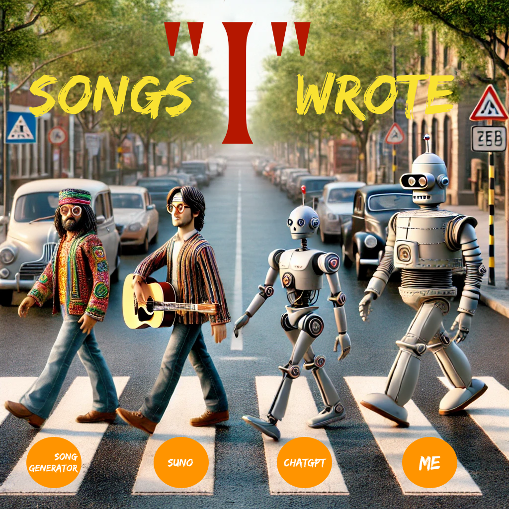

[Album Booklet in PDF Format](songs_i_wrote.pdf)
# Songs "I" Wrote
1.	Tennessee Sky: A song about last year’s road trip with my kids.
2.	Me to Me: A post-50 man reflecting on life, letting go of the past, and living fully in the days ahead.
3.	Frozen Monk: A monk who, after years of practice, realizes there’s no ultimate wisdom—what does he do next?
4.	Blow Who, San Francisco: Observations from my 2023 trip to San Francisco, capturing America as I saw it.
5.	Stars in Mind: A song for my kids, celebrating humanity’s upcoming journey into space.
6.	Santa, Get Me a Ride: A bittersweet, slow Christmas song with a playful twist on my favorite holiday.
7.	Dragon Code, Math Untold: Revealing the secrets behind learning math from elementary through high school.
8.	Unlock It All: Written for friends with depression, inspired by Yoshimoto Banana’s novel Amrita.
9.	Steve’s Dots: My twenty-year reflection on Steve Jobs’ Stanford speech as a foundation for my thinking.
10.	Death’s Gift: If you were given a chance to relive your life after doing one good deed, how would you live your final days?
	
# The Story Behind This Album
In the “Silicon Valley 101” podcast, Mr. Feng mentioned that while AI can compose music with technical skill, it can’t instill motive and soul, which sets human musicians apart. This insight inspired me to merge my creativity with AI, making these songs truly my own.

For years, I’ve wanted to create music, but my limited skills kept me from turning melodies into something real. In August 2024, I finally did it—starting with “Tennessee Sky,” inspired by a road trip with my kids. Using songgenerator.io, I shaped my lyrics into music, making the first of ten songs.

Next, I explored a topic I’ve pondered for years: how to approach life after 50. “Me to Me” was born from conversations with ChatGPT, creating a light, contrasting song with a deeper message. I then delved into religion with “Frozen Monk,” a serious piece about a monk’s existential crisis after years of seeking wisdom.

Switching gears, I wrote “Stars in Mind,” a passionate, hopeful song about humanity’s upcoming space adventures, dedicated to my child. Afterward, I created a Christmas song for myself, “Santa, Get Me a Ride,” adding a bittersweet twist to my favorite holiday.

I also tackled the subject of K-12 math, revealing its secrets in “Dragon Code, Math Untold.” Surprisingly, I managed to turn this complex idea into a song. Inspired by Yoshimoto Banana’s Amrita, I wrote “Unlock It All” for those struggling with depression, capturing a moment of healing.

Reflecting on Steve Jobs’ “connecting the dots” philosophy from his Stanford speech, I crafted “Steve’s Dots,” a powerful, rock-infused song to set the stage for the final piece. The last song, “Death’s Gift,” came to me one morning—imagining a second chance at life offered by death due to a small good deed.

Creating this album in a week was a blend of AI’s capabilities and my own creative input. It’s not perfect, but these songs are deeply personal, written by me, for me. I hope you enjoy them and feel inspired to create your own music. Embrace the power of AI and see what you can achieve.

# Song One: Tennessee Sky
- via SongGenerator.io, with styles "catchy, Japanese, violin".
```markdown
TENNESSEE SKY

Cherokee land, brave souls reside.
Open roads, where dreams arise.
Mountains sing, stories they hide,  
Thousand years into lullabies.

Eagles soar, across the divide,  
Grass fields gather, side by side.  
Follow I-81 the world slides by,  
From Tennessee's warmth to the morning sky.

Now I feel, a spark ignite,  
Won't hold back, won't lose the fight.  
Follow dreams, where clouds do tie, 
Open my wings, and learn to fly.

Freeways continue hundred miles,  
Leading me to where eagles vie.  
Don't cry, Tennessee, I'll be fine. 
I'll chase the sun, hold the skies.

Remember, the stars do never lie,  
I'll shine my brightest, reaching high.  
For every ending, say a new goodbye,  
I'll come back, under your southern sky.

Now I feel, a spark ignite,
Won't hold back, won't lose the fight.
Follow dreams, where clouds do tie,
Wings open without hiding,
Move on without doubting,
Find my way and truly fly.
```

# Song Two: Me to Me
- via Songgenerator.io, with styles: "jazz, piano, solo, deep night, cool bar, country".
```markdown
Verse 1:
As twilight fades, whispers in the air,
I feel the shift, a life laid bare.
The first act’s done, the curtain’s drawn,
Now I greet the quiet dawn.
Memories drift like leaves on wind,
Some have settled, some rescind.

Chorus:
Though the years have passed, I stand so free,
With a heart that’s young, I face what’ll be.
The road may curve, the night may call,
But I’ll keep my pace, won’t fear the fall.
The past is light, no chain to bind,
Eyes ahead, with a fearless mind.

Bridge:
Through the mist, the path unwinds,
With youthful steps, I’ll trace the lines.
Now I stand, with soul alight,
As the last act fades into night.
```

# Song Three: Frozen Monk
- via songgenerator.io, with styles: "ethereal, male voice, asian, ancient, meditation".
```markdown
Verse 1:
For decades I’ve wandered, seeking the truth,
Through trials and questions, from my youth.
The answers hide, like shadows in the night,
My heart restless, never in sight.
In the silence of the mountains, the world fades away,
But inside, the turmoil refuses to sway.

Chorus:
Is it all just the fire of desire,
Burning within like a raging pyre?
As the years pass, the storm calms down,
But the quest for peace still makes me frown.
If all is just driven by the flames we know,
Then what’s the path to where the wise go?

Verse 2:
Wild thoughts crash like a beast untamed,
Like a tiger stalking, never named.
As a monk, they see wisdom in my eyes,
But they don’t know, it’s all a guise.
Decades gone, how can I turn back?
Decades gone, how to ease the lack?
They come to me, seeking light and peace,
But inside, my turmoil will not cease.

Chorus:
If all they want is a comforting lie,
Is it mercy to not let them cry?
Though the truth in me is dark and cold,
I dare not speak what can’t be told.
The rock inside, it cuts like ice,
Growing harder, no warmth, no light.

Bridge:
As the years pass by, my silence grows,
A burden heavy, that no one knows.
I’m the monk they seek for hope and grace,
But the truth I bear, I can’t embrace.
If I speak, the world might shatter,
So I keep the lie, does it even matter?
```

# Song Four: Stars in Mind
 - via suno.com, with styles: "motivation, march, light, positive, rock, guitar, clean, Japanese, bright, rock, 1980, drum".
 ```markdown
 Verse 1:
On a mountain in the dark of night,
Little Johnny gazes at the sky so bright.
In his heart, he whispers clear,
“One day soon, I’ll conquer fear.”

Chorus:
One day, I’ll fly where the stars collide,
Through the night, with dreams as my guide.
I’ll climb so high where the heavens shine,
In the light, my future’s mine.

Verse 2:
No longer a child, Johnny stands tall,
His dreams, his strength, through it all.
Gazing up at the starry night,
He’ll paint the world with endless light.

Chorus:
One day, I’ll fly where the stars collide,
Through the night, with dreams as my guide.
I’ll climb so high where the heavens shine,
In the light, my future’s mine.

Bridge:
With wings of hope, he’ll touch the sky,
No limits here, no reason why.
No fear of dark, no doubt inside,
For in the stars, his fate’s aligned.
 ```
 
 # Song Five:  Blow Who, San Francisco
 - via suno.com, with styles: "rap, angry, battle, black, poor, strong, hatred, strong, fight".
 ```markdown
 Verse 1:
Walking the line between heaven and hell,
This is America, can you hear the bell?
Why’s it so different? Why’s it so strange?
Some kids code the cloud, others locked in chains.

Some rise up to build, others fall to sell,
One’s in a penthouse, the other’s in a cell.
Good and bad, rich and poor, all in the mix,
You say it’s a melting pot, I say it’s a fix.

Chorus:
Strolling through the hills of San Fran’s scene,
Rich homes on the block, but the streets are mean.
Pacific winds blow, but they can’t erase,
The gap that’s growing, the divide we face.

Verse 2:
In the land of dreams, there’s a chasm so wide,
Silicon Valley’s glow, where the lost souls hide.
They preach opportunity, land of the free,
But why so many drown in the deep blue sea?

From the heights of the hills, see the pain and pride,
Where the wealthy thrive, and the broken slide.
Is this the dream? Is this the deal?
Or just a place where they steal what’s real?

Chorus:
Strolling through the hills of San Fran’s scene,
Rich homes on the block, but the streets are mean.
Pacific winds blow, but they can’t erase,
The gap that’s growing, the divide we face.

Bridge:
Between the gold and the grime, the truth gets lost,
In a land of riches, but at what cost?
Walking between heaven and hell, it’s all in play,
In a cage of worlds, who’s gonna pay?
 ```
 
 # Song Six: Santa, Give Me a Ride
  - via suno.com, with styles: "start with slient night, then vary to different rhyme, fun, sad, string, and at last return to the classic old song"
  ```markdown
  Verse 1 (Starting with a classic Christmas song):
Silent night, holy night,
All is calm, all is bright,
But my heart, it’s filled with dread,
As I fly to you, half the world ahead.

Verse 2:
I’ve missed you so, it’s been too long,
Christmas bells, they sing our song.
But when I arrive, my dreams collide,
You’ve moved on, with him by your side.

Chorus:
Christmas, why am I so tired?
I wished Santa’d give me a ride.
To leave this place, to say goodbye,
But why do I even try?

Verse 3:
The snow is falling, the night is cold,
I’m here alone, no hand to hold.
I wanted to see the light in your eyes,
But now I see, they’ve said their goodbyes.

Bridge:
Santa, take me far from here,
Fly me away, make it disappear.
I know it’s over, but still, I cry,
Hoping you’ll be by my side.

Chorus (Reprise):
Christmas, why am I so tired?
I wished Santa’d give me a ride.
To leave this place, to say goodbye,
But why do I even try?

Outro (Returning to the classic):
Sleep in heavenly peace,
Sleep in heavenly peace…
  ```
  
  # Song Seven: Dragon Code, Math Untold
 - via songgenerator.io, with styles: "rap, battle, gaming, Japanese, marching, male voice, electric, intense, passion, catchy".
 ```markdown
 Verse 1:
Yo, ready, go—let’s step in the flow,
4,000 days, watch your knowledge grow.
Quadratic’s the boss, in the shadows it’ll show,
Guarding the key, where the brave must go.

Functions and equations, they set the tone,
X and Y unknown, where answers are sown.
Curves like wings, spreading out low,
Fire on the track, but you’re ready to glow.

Chorus:
Step up to the challenge, take it slow,
Beat the dragon down, let your skills overflow.
Master the code, don’t let fear grow,
Ride the wave where the champions go.

Verse 2:
Sine and cosine, more dragons to know,
Twisting the path, where the numbers flow.
Exponents rise, logs bring it low,
Transforming the digits in a rhythmic show.

They try to scare, with symbols that glow,
But break through the wall, let your confidence show.
Master the craft, let your courage grow,
In the world of math, you’ll lead the show.

Outro:
Constants like  e  and  \pi  below,
Imaginary numbers, they join the flow.
AI, space, robot—you’ll make it so,
Math’s the key, where your future will grow.
 ```
 
 # Song Eight - Unlock It All
  - via songgenerator.io, with styles: "Female vocals, rich and deep, story-like, magnetic charm, emotive, soft piano, subtle strings, light percussion".
  ```markdown
  Verse 1:
We left behind the city’s rush, where shadows steal the light,
Found refuge on a quiet shore, where the day turns into night.
My brother’s heart weighed down, we sought a place to mend,
In the gentle breath of island winds, our burdens start to bend.

Verse 2:
Each day we walked familiar paths, where nothing seemed to change,
The sands, the sea, they stayed the same, yet felt a bit more strange.
The world so small, the time so slow, until that fateful hour,
When the sky began to whisper low, revealing all its power.

Chorus:
Sky on fire, hearts unfold,
Sunset whispers, secrets told.
Colors crash, in twilight’s call,
In that light, we stood in awe.

Verse 3:
In that glow, we found a peace, that words could never name,
The sky, it painted life anew, with every shifting flame.
We walked along that golden path, no need for words to speak,
For in that sunset’s warm embrace, our hearts found the key to unlock it all.

Chorus:
Sky on fire, hearts unfold,
Sunset whispers, secrets told.
Colors crash, in twilight’s call,
In that light, we stood in awe.
  ```
  
  # SONG Nine - Steve's Dots
  - via suno.com, with styles: "Raw, gritty 1980s rock with electric guitars, heavy drums, and passionate male vocals, raw energy, intense riffs".
  ```markdown
  Verse 1:

Threads of time, spreading where they flow,
Dots we trace, unsure where they’ll go.
Every choice, a shadow in the glow,
But trust the journey, let the meaning grow.

Chorus:

In the dance of fate, we find our flow,
In shadows cast, the dots will show.
Each step we take, a seed we sow,
In the end, what’s left to show?

Verse 2:

Follow echoes where the winds may blow,
Through the night, where hidden dots lie low.
In every scar, a story starts to grow,
And in the quiet, all the dots will show.

Bridge:

As twilight dims, the final dots will glow,
Questions rise: which path was worth the throw?
When the curtain falls, and the answers slow,
Will the road you walked, connect the dots you know?

Chorus (Reprise):

In the dance of fate, we find our flow,
In shadows cast, the dots will show.
Each step we take, a seed we sow,
In the end, what’s left to show?
  ```
  
  # Song Ten: Death's Gift
  - via suno.com, with styles: "Cinematic rock ballad with soaring guitars, powerful drums, and emotional piano, blending intensity and introspection".
  ```markdown
  Verse 1: 
Eighty years, I rode the tide,
But on that day, death walked beside.
“He whispered low, ’You did some good,
Not much, but some, just as you could.’”
He offered a gift, a twist of fate,
To turn the clock, reset the date.

Chorus:
This is my second chance, a brand new play,
No memories left to light the way.
Will I stand strong, or will I sway?
It’s a one-shot road, no debts to pay.

Verse 2:
Forgotten all, from now to then,
The highs, the lows, the where and when.
But here I stand, with life anew,
A chance to change, to see it through.
Can I walk the path with no regret?
In this journey’s end, what will I get?

Chorus:
This is my second chance, a brand new play,
No memories left to light the way.
Will I stand strong, or will I sway?
It’s a one-shot road, no debts to pay.

Bridge:
No need to trade my soul away,
A small gift earned along the way.
Can’t go back to twenty, but here I stay,
A billionaire would pay for this last day.
A king would give his crown away,
So I’ve got no complaints, just thanks to say.

Chorus (Reprise):
This is my second chance, a brand new day,
No memories left to show the way.
Will I choose right, or will I stray?
It’s a one-way road, no debts to pay.

Outro:
Today’s the gift, the path I lay,
No past to bind, no future sway.
This second chance, my course to pave,
With every step, what dreams to save?
  ```
  